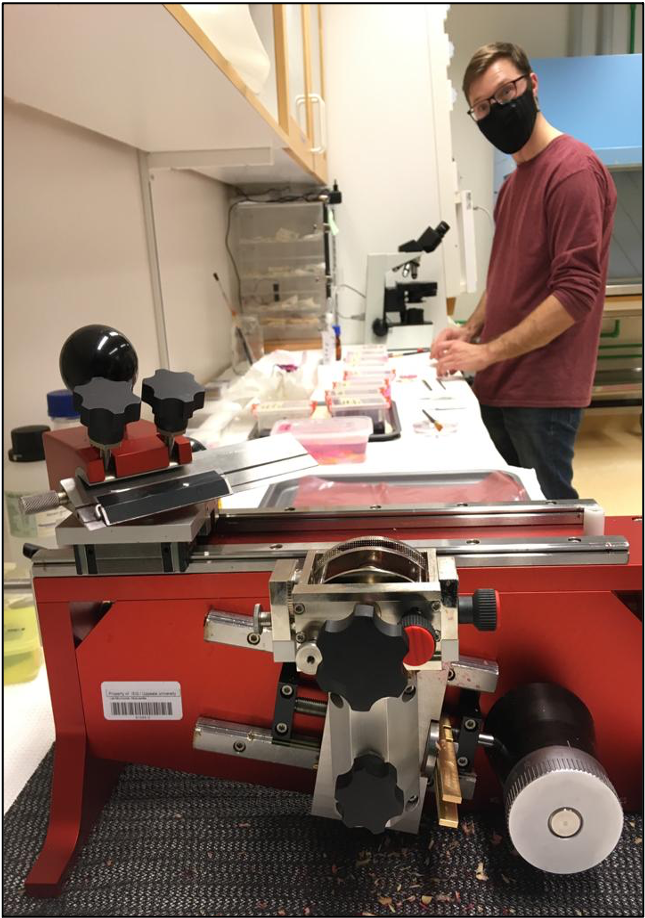
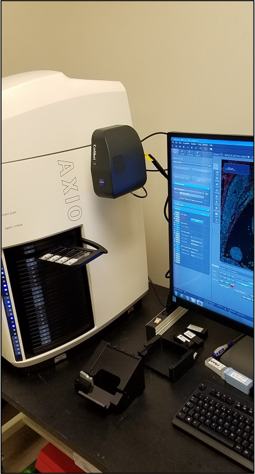
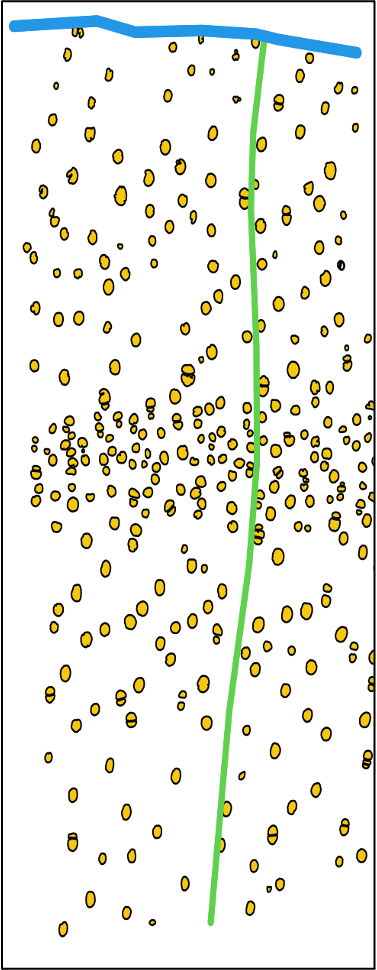
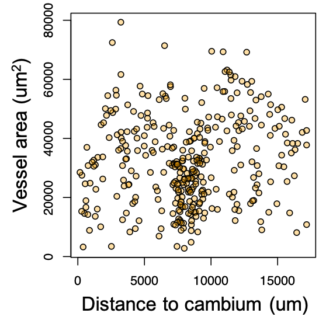

# Methods {-}

Here we describe the methods, from field to data.


### 1. Sample collection {-}
Collecting samples for wood anatomical analysis requires careful consideration of the research questions or objectives.

- Sample size
- Position of sample
- Other data to record

**Additional Resources**

- reference 1
- reference 2
- ...

### 2. Sectioning and slide preparation {-}

```{r, out.height="40%", fig.cap="Sectioning samples with the WSL lab microtome.", echo=FALSE, fig.align = 'center'}

```

### 3. Image capture {-}

```{r, out.height="40%", fig.cap="Scanning slides with the Zeiss slide scanner.", echo=FALSE, fig.align = 'center'}

```

### 4. Image analysis {-}

Details on the protocol...

- [`QuPath`](https://qupath.github.io/)


### 5. Processing of annotated images in R {-}
We have developed the `qwar` R package to process the annotated images (as .svg files).  You can see the [source code on Github](https://github.com/bobmuscarella/qwar) and install the package like this:

```{r, eval=FALSE}
library(devtools)
devtools::install_github("bobmuscarella/qwar")
```

Some examples of possible outputs from the `qwar` R package are shown below.

```{r, out.height="20%", fig.cap="An example of output from the `qwar` R package.", echo=FALSE, fig.align = 'center'}

```

```{r, out.height="40%", fig.cap="Quantifying vessel area as a function of distance to cambiumusing the `qwar` R package.", echo=FALSE, fig.align = 'center'}

```


