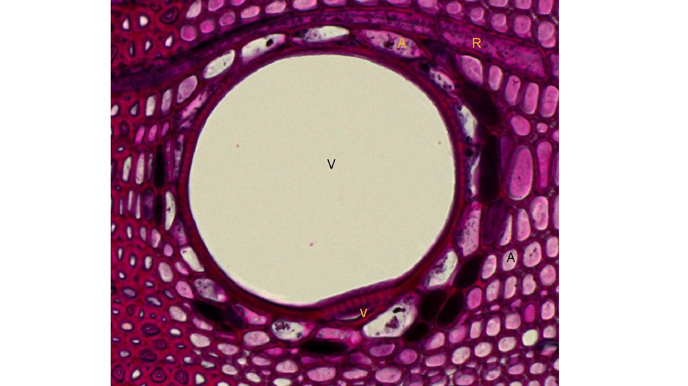

--- 
title: "Wood Anatomy of Puerto Rican Trees"
author: "Silvia Bibbo, Kasia Ziemińska, Robert Muscarella"
date: "`r Sys.Date()`"
site: bookdown::bookdown_site
output: bookdown::gitbook
documentclass: book
bibliography: [packages.bib]
biblio-style: apalike
link-citations: yes
github-repo: bobmuscarella/Book-Wood-anatomy-of-PR-trees
description: "This is a field guide to wood anatomy of Puerto Rican trees."
---

# Introduction {-}

This book is a Guide to the Wood Anatomy of Puerto Rican Trees.  It is a living document and includes general information as well as raw data and references.

For more details, please contact [Bob Muscarella](robert.muscarella@ebc.uu.se).

```{r, out.height="60%", fig.cap="*Inga laurina*", echo=FALSE, fig.align="center"}

```


```{r include=FALSE}
# automatically create a bib database for R packages
knitr::write_bib(c(
  .packages(), 'bookdown', 'knitr', 'rmarkdown'
), 'packages.bib')
```
